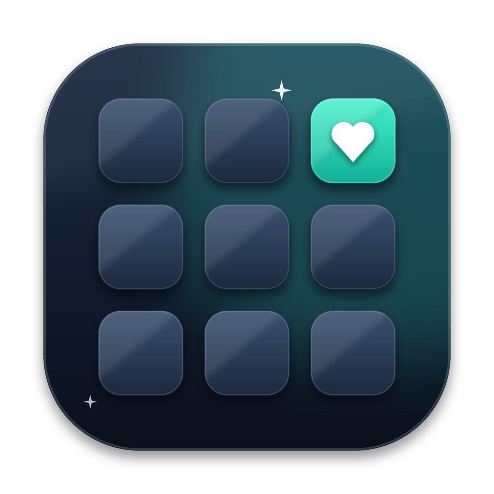
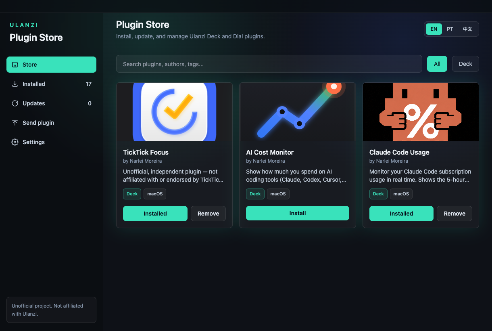
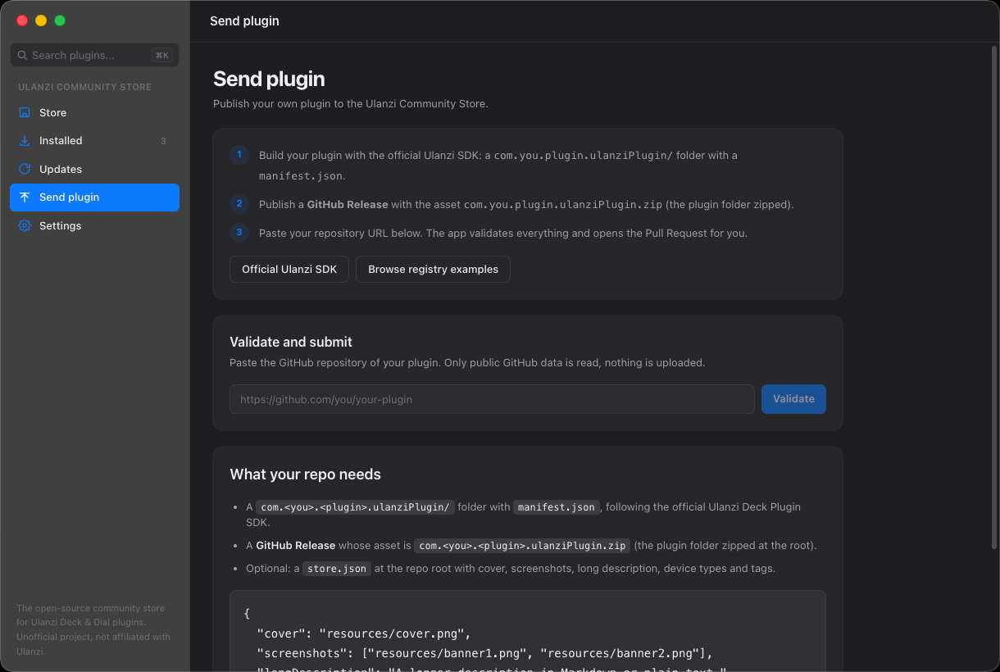
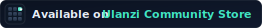

<div align="center">



# Ulanzi Community Store

**The open-source community store for Ulanzi Deck & Dial plugins.**
Built by fans of Ulanzi gear — publish in minutes, install in one click, update automatically.

[](https://github.com/narlei/ulanzicommunitystore/releases/latest)
[](https://github.com/narlei/ulanzicommunitystore/actions)
[](LICENSE)
[](https://github.com/narlei/ulanzicommunitystore/releases/latest)
[](#-publish-your-plugin)

[**🌐 Website**](https://ulanzicommunitystore.narlei.com) · [**⬇️ Download**](https://github.com/narlei/ulanzicommunitystore/releases/latest) · [**🚀 Publish your plugin**](https://narlei.github.io/ulanzicommunitystore/#publish) · [**🧩 Browse the community registry**](registry/README.md)



</div>

---

## 💚 What this is (and isn't)

The Ulanzi Deck and Dial are great hardware, and the community keeps building great plugins for them. The **Ulanzi Community Store** is where those plugins live in the open: a community-run, open-source catalog where **anyone can publish a plugin with a Pull Request** and every GitHub Release ships as an update to every user, instantly.

**It is not a replacement for the official Ulanzi Studio Marketplace — and it doesn't want to be.** The official marketplace is where plugins get Ulanzi's review and stamp of approval. The Community Store is the companion fast lane: a place for makers to ship early, iterate quickly with users, and grow the ecosystem around Ulanzi devices. More plugins, faster updates, more reasons to love the hardware. That's the whole mission.

- 🚀 **Publish in minutes** — one Pull Request, automated validation, and your plugin is live. No waiting queue.
- 🔄 **Updates ship instantly** — every new GitHub Release of your plugin becomes an update in the store.
- 🛍️ **One-click install** — browse the catalog and install straight into your Ulanzi plugins folder.
- 🌍 **Multilingual** — English, Português, and 中文 out of the box.
- 🔐 **Safe by default** — only plugins from the reviewed community registry are installable; ZIPs are validated before anything touches your disk.
- 🖥️ **Native desktop app** — Electron + React + TypeScript, for macOS and Windows.
- 🔓 **100% open source** — the app, the registry, and the pipeline. Audit it, fork it, contribute to it.

> **Note** — This is an unofficial, community-driven project made by people who love Ulanzi hardware. It is not affiliated with, endorsed by, or maintained by Ulanzi. For official plugins and support, see the Ulanzi Studio Marketplace.

## ⬇️ Download

**One-line install** (detects your OS and installs the right build):

```bash
# macOS (Terminal) · Windows (Git Bash / WSL)
curl -fsSL https://raw.githubusercontent.com/narlei/ulanzicommunitystore/main/install.sh | bash
```

```powershell
# Windows (PowerShell) — native path, no bash required
irm https://raw.githubusercontent.com/narlei/ulanzicommunitystore/main/install.ps1 | iex
```

- macOS: [`install.sh`](install.sh) downloads the latest `.zip` into `/Applications`. Files fetched with `curl` aren't tagged with `com.apple.quarantine`, so Gatekeeper never blocks the app.
- Windows: the same script (or [`install.ps1`](install.ps1) on PowerShell) downloads `UlanziPluginStore.exe` and launches the NSIS installer.

Or grab the installer manually from the [**releases page**](https://github.com/narlei/ulanzicommunitystore/releases/latest):

| Platform | Artifact |
| --- | --- |
| 🍎 macOS | `.dmg` / `.zip` |
| 🪟 Windows | `.exe` (NSIS installer) |

macOS `.dmg` downloads trigger a Gatekeeper warning on first launch since the app isn't notarized (no Apple Developer account) — see [Releases](#-releases) below for how to get past it.

Or visit the website: [**ulanzicommunitystore.narlei.com**](https://ulanzicommunitystore.narlei.com)

## 🚀 Publish Your Plugin

Built something cool for your Deck or Dial? This is the fast lane: getting it into the Community Store takes minutes, and every release you ship afterwards reaches your users automatically.

<div align="center">

</div>

**The happy path:**

1. 🧰 Scaffold or adapt with the [plugin starter](plugin-starter/README.md): `npx ulanzi-plugin-starter@latest init` (or `store` if you only need `store.json`).
2. 🏷️ Push a version tag — the starter workflow attaches `*.ulanziPlugin.zip` for you.
3. 📤 Paste the repo URL in the app's **Send plugin** tab or the [**Publish section on the website**](https://ulanzicommunitystore.narlei.com/#publish). We validate and open the Pull Request.

**What your repo needs:**

1. 📦 A `com.<you>.<plugin>.ulanziPlugin/` folder with a `manifest.json` at the repo root ([official Ulanzi SDK](https://github.com/UlanziTechnology/UlanziDeckPlugin-SDK) is the API reference).
2. 🏷️ A **GitHub Release** whose asset is `com.<you>.<plugin>.ulanziPlugin.zip`.
3. 🎨 Optional: a `store.json` at the repo root — generate with `npx ulanzi-plugin-starter@latest store`.

Once your PR is merged, a GitHub Action reads your manifest and latest release and publishes the plugin automatically. **Every new release you ship becomes an update for every user.** Full details in the [registry guide](registry/README.md).

Publishing here doesn't lock you in — the same plugin can (and should!) also go to the official Ulanzi Studio Marketplace. The Community Store is simply where it can live and evolve while you iterate.

### 🏷️ Badge for your plugin README

After your plugin is listed, add this to your README so people can see you're on the Community Store:

[](https://ulanzicommunitystore.narlei.com)

```markdown
[](https://ulanzicommunitystore.narlei.com)
```

Shield-style and shields.io alternatives live in [`docs/badges/`](docs/badges/README.md).

## 🧰 Plugin Starter Kit

Don't want to build the folder structure from scratch? We provide an official scaffolding tool that generates the manifest, a `Makefile` for local testing, and the GitHub Actions workflow for automatic releases.

```bash
npx ulanzi-plugin-starter@latest init
```

*(Requires [Node.js](https://nodejs.org) installed on your machine)*

Full documentation for the starter kit is available [here](plugin-starter/README.md).

## 🏗️ Project Structure

| Path | Purpose |
| --- | --- |
| [`apps/store-desktop/`](apps/store-desktop) | Electron + React + TypeScript + Vite desktop app |
| [`apps/marketing-site/`](apps/marketing-site) | Static marketing site ([ulanzicommunitystore.narlei.com](https://ulanzicommunitystore.narlei.com)) |
| [`packages/catalog/`](packages/catalog) | Catalog types, registry validation, and `catalog.json` builder |
| [`registry/plugins/`](registry/plugins) | **Community registry** — source of truth for approved plugin repos |
| [`VERSION`](VERSION) | App release version — changing it on `main` triggers a release |

## 🛠️ Development

Everything goes through the [`Makefile`](Makefile):

```bash
make run    # install deps, build catalog, typecheck, build and open the app
```

Useful targets:

```bash
make app               # launch the app in dev mode
make typecheck         # type-check everything
make catalog           # generate dist/catalog/catalog.json (uses gh auth token)
make catalog_validate  # validate registry entries
make release           # sync version + build distributables
make marketing         # serve the marketing site locally
make version           # print the current app version
```

By default the app loads the locally generated catalog at `dist/catalog/catalog.json`. Override the source when needed:

```bash
STORE_CATALOG_FILE=/absolute/path/catalog.json make app
STORE_CATALOG_URL=https://example.com/catalog.json make app
```

## 📦 Releases

[`VERSION`](VERSION) is the single source of truth. When it changes on `main`, GitHub Actions builds and publishes a release with the macOS `.dmg` + `.zip` and the Windows `.exe`. Artifacts are ad-hoc signed (no Apple Developer account, not notarized).

**Recommended install** (auto-detects macOS vs Windows):

```bash
# macOS · Windows (Git Bash / WSL)
curl -fsSL https://raw.githubusercontent.com/narlei/ulanzicommunitystore/main/install.sh | bash
```

```powershell
# Windows PowerShell
irm https://raw.githubusercontent.com/narlei/ulanzicommunitystore/main/install.ps1 | iex
```

On macOS, [`install.sh`](install.sh) fetches the latest `.zip` into `/Applications`. Files downloaded via `curl` aren't tagged with `com.apple.quarantine`, so Gatekeeper never blocks the app. On Windows it downloads the `.exe` and launches the installer (see also [`install.ps1`](install.ps1)).

**macOS — manual `.dmg` download:** since the DMG is downloaded through a browser, it does get quarantined and Gatekeeper will block the first launch. To open it:

1. Drag **Ulanzi Community Store.app** to `/Applications` and try to open it — macOS will block it on the first attempt. That's expected.
2. Go to **System Settings → Privacy & Security**, scroll to the Security section, and click **Open Anyway** next to the message about Ulanzi Community Store being blocked.
3. Try opening the app again — a new dialog appears with an **Open** button. Click it.

(Right-click → Open no longer shows a bypass option on recent macOS versions — the Settings route above is the reliable one.) Or just clear the quarantine flag manually:

```bash
xattr -cr "/Applications/Ulanzi Community Store.app"
```

The catalog (`catalog.json`) is generated — never versioned. Registry entries in [`registry/plugins/*.json`](registry/plugins) are the source of truth, published automatically through GitHub Pages.

## 🔐 Security Model

- The app installs **only** plugins from the community registry catalog by default.
- ZIP extraction validates plugin IDs and entry paths before writing to the Ulanzi plugins folder.
- Developer Mode is reserved for future manual installs.
- **Daily vulnerability scan** — a scheduled GitHub Action ([`security-scan.yml`](.github/workflows/security-scan.yml)) scans every repo in the [community registry](registry/plugins) once a day with [Trivy](https://github.com/aquasecurity/trivy), looking for known-vulnerable dependencies and leaked secrets. Findings are posted to the run summary and to a single rolling GitHub issue (opened when something is found, closed automatically when everything is clean). Because these are third-party repos, the scan **flags** issues for maintainers to act on — it doesn't modify anyone's code.

> Run it on demand from the **Actions** tab (**Run workflow**) or with `gh workflow run security-scan.yml`.

## 📄 License

[MIT](LICENSE) © [Narlei Moreira](https://github.com/narlei)

---

<div align="center">

**[Website](https://ulanzicommunitystore.narlei.com)** · **[Download](https://github.com/narlei/ulanzicommunitystore/releases/latest)** · **[Publish a plugin](https://narlei.github.io/ulanzicommunitystore/#publish)** · **[Report an issue](https://github.com/narlei/ulanzicommunitystore/issues)**

*Made with 💚 by the community, for the community. Unofficial project — not affiliated with Ulanzi.*

</div>
