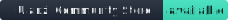

# Ulanzi Community Store badges

Use these badges in your plugin README to show that the plugin is available on the **Ulanzi Community Store**.

## Preview

### Brand badge (recommended)

[](https://ulanzicommunitystore.narlei.com)

### Shield style

[](https://ulanzicommunitystore.narlei.com)

## Copy-paste for your README

### Brand badge

```markdown
[](https://ulanzicommunitystore.narlei.com)
```

### Shield style

```markdown
[](https://ulanzicommunitystore.narlei.com)
```

### shields.io (no asset)

If you prefer not to hotlink an SVG from this repo:

```markdown
[](https://ulanzicommunitystore.narlei.com)
```

## Website URLs (after marketing deploy)

Same files are also published on the marketing site:

```markdown
[](https://ulanzicommunitystore.narlei.com)
```

```markdown
[](https://ulanzicommunitystore.narlei.com)
```

Prefer the `raw.githubusercontent.com` URLs above if you want the badge to work even when the marketing site is unavailable; use the website URLs for a shorter branded host.

## Tips

- Prefer the **brand badge** when you want the store icon and wording to stand out.
- Prefer the **shield** when you already have a row of shields.io badges.
- Link to [ulanzicommunitystore.narlei.com](https://ulanzicommunitystore.narlei.com) (or your plugin page on the site when available).
- Only use the badge after your plugin is listed in the [community registry](../../registry/plugins).
